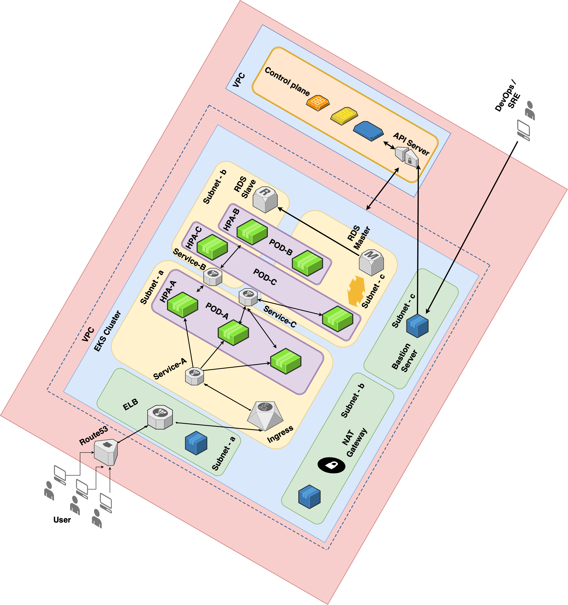

Creating a Virtual Private Cloud (VPC) and an Amazon Elastic Kubernetes Service (EKS) cluster using Terraform and Deploying Applications with Helm Chart

- Prerequisites

Before you get started with creating VPC and EKS using Terraform, make sure you have the following requirements:

- An AWS account
- AWS Command Line Interface (CLI) installed on your machine
- Terraform installed on your machine
- Helm Installed on your machine
- Kubectl installed on your machine
- Architecture

In this scenario, we are using Terraform to set up infrastructure for a EKS managed Kubernetes cluster and deploying Kubernetes applications using a Helm chart.

Firstly, we will create a VPC with 3 public subnets and 3 private subnets along with a NAT gateway. The public subnet can be used to deploy a bastion server and the NAT gateway, which will allow private instances in the VPC to egress traffic to the internet. This can be achieved with the help of the "terraform-aws-modules/vpc/aws" module and relevant input parameters.

Next, we will create an Amazon Elastic Kubernetes Service (EKS) cluster with managed node groups using the "terraform-aws-modules/eks/aws" module. The managed node groups will create EKS cluster nodes in the private subnets that can communicate with the internet via the NAT gateway. We can configure the minimum, maximum, and desired size of the node group using input parameters, which is set as min\_size = 2, max\_size = 10, desired\_size = 3 in this case. Additionally, we will also install some EKS cluster add-ons such as coredns, kube-proxy, vpc-cni.

After creating the EKS cluster and its related resources, we will set up an RDS MySQL database in the private subnet. We will configure a security group on the RDS instance to only accept requests from the VPC CIDR range, ensuring that it is accessible only from within the VPC. We can use the "terraform-aws-modules/rds/aws" module to create and configure the RDS instance.

Finally, we will create a route DNS zone which can be configured manually once the Elastic Load Balancer (ELB) endpoint is created. This can be achieved using the "aws\_route53\_zone" resource block.

To deploy Kubernetes applications, we will use Helm, which is a package manager for Kubernetes. We will create a Helm chart, which is a set of YAML files that define the Kubernetes resources required for the application. We will then use Terraform's "helm\_release" resource to install the Helm chart on the EKS cluster. This resource can be used to deploy the Helm chart, upgrade it, or even uninstall it.

We are using Helm charts to deploy three applications, one frontend and two backend, which will all use an RDS database as their backend storage solution. The applications are separated into three separate charts, each with their own set of Kubernetes resources and dependencies.

The first chart is the frontend application, which will be responsible for rendering the user interface and interacting with the backend applications. This chart will include the deployment and service resources for the frontend application, as well as any other resources that the application requires, such as config maps or secrets. The chart will also include a values.yml file, which will contain the configuration options for the frontend application. These values can be overridden when installing the chart, allowing for customization of the application at deployment time.

The second and third charts are the backend applications, which will handle the business logic and data storage for the application. These charts will include the deployment and service resources for each backend application, as well as any other resources required by the application. The backend applications will be configured to use the RDS database as their storage solution, with the necessary credentials provided through the values.yml file.

The values.yml file will be used to manage the configuration of all three charts, including the RDS credentials, as well as any other configuration options required by the applications. The use of a global values file allows for easy management of configuration across all charts, as changes made to the file will be applied to all charts that use it.

Overall, the use of Helm charts and a global values file allows for the easy deployment and management of complex applications with multiple components, while also providing a centralized location for managing configuration options. The use of an RDS database as a backend storage solution also provides a scalable and reliable solution for storing application data.

Overall, this approach provides a robust and scalable solution for deploying Kubernetes applications in a secure and highly available environment. By using Terraform, we can easily manage the infrastructure and ensure consistency across different environments.

- Steps

Step 1: Set up AWS credentials

The first step is to set up your AWS credentials on your machine. You can do this by running the following command in your terminal:

\```

$ aws configure

\```

You'll be prompted to enter your AWS access key, secret access key, default region, and output format. Once you've entered your credentials, you're ready to proceed.

Step 2: change directory to project directory ```

$ cd /path/aws-eks-terraform/

\```

Step 3: Initialise terraform

The terraform init command initializes a working directory containing Terraform configuration files. This is the first command that should be run after writing a new Terraform configuration or cloning an existing one from version control. It is safe to run this command multiple times.

\```

$ terraform init

\```

Step 4: Execute plan for terraform

The terraform plan command creates an execution plan, which lets you preview the changes that Terraform plans to make to your infrastructure

\```

$ terraform plan

\```

Step 5: Execute terraform apply command

The terraform plan command creates an execution plan, which lets you preview the changes that Terraform plans to make to your infrastructure

\```

$ terraform apply -auto-approve

\```

You can pass the -auto-approve option to instruct Terraform to apply the plan without asking for confirmation. Step 6: Verify the Cluster

Use kubectl commands to verify your cluster configuration.First, get information about the cluster.

\```

$ kubectl cluster-info

\```

Step 7: Terraform also execute helm charts

1. Nginx Ingress - It will install and setup AWS ingress controller
1. Project - It will install and setup 3 application with ingress

Step 8: ELB will be created once terraform succeed

Configure ELB endpoint to route53 public host zone which is created with terraform

\## Manual Steps if we already has kubernetes cluster configured

Step 1: Update database values in values.yml file

Update Database hostname and cred in values.yml file endpoint: my-rds-endpoint.us-east-1.rds.amazonaws.com

username: my-rds-username

password: my-rds-password

database: my-database

Step 2: Deploying Application and service with Helm Repository ```

$ helm install setu-project project/

\``` Note:

In the current implementation, sensitive data has been exposed and defined in the values.yml file and in the Terraform script. Credentials have been defined in the values.yml file, while in the Terraform script, a local backend has been used for the state file.

However, it is not advisable to expose sensitive data in plain text in a production environment. In a production environment, it is recommended to store the state file in a secure and reliable location such as S3. Additionally, sensitive data such as credentials can be stored securely using a tool like Hashicorp Vault.
